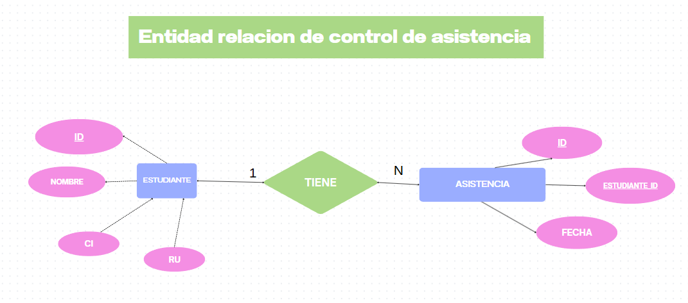

# 📦 Base de Datos - controlador de asistencias

## 📊 Modelo Relacional
          
      
## 📁 Estructura de Carpetas

control_asistencias/
├── controlador/
│   ├── registrar_estudiantes.php
│   ├── registrar_asistencia.php
│   └── eliminar_asistencia.php
│
├── modelos/
│   └── conexion.php
│   └── editar_asistencia.php
│   └── lista_de_asistencia.php
│   └── tomar_asistencia.php
│
├── vistas/
│   ├── control_de_asistencia.php
│   ├── lista_asistencia_vista.php
│   ├── editar_asistencia_vista.php
│   ├── registrar_asistencia_vista.php
│   └── color.css
│
├── index.php
└── documentacion.md (documentación)

# 📦 Estructura del Proyecto - Control de asistencia

Este proyecto representa un sistema de control de asistencia basico, con separaciones en capas: **controladores**, **modelos** y **vistas**.

---

## 📁 controlador/
Contiene la lógica del servidor, acciones o intermediarios entre vistas y modelos.

- `registrar_estudiantes.php`: Inserta un nuevo estudiante usando los datos del formulario.
- `registrar_asistencia.php`: Registra la asistencia de un estudiante.
- `eliminar_asistencia.php`: Elimina una asistencia de la base de datos.

---

## 📁 modelos/
Contiene las clases que representan y manipulan los datos del sistema.

- `Conexion.php`: Clase encargada de la conexión con la base de datos.

---

## 📁 viestas/
Contiene las interfaces visuales que el usuario final verá.
- `index.php`: Vista principal del sitio web. 
- `registrar_asistencia_vista.php`: Formulario para registrar asistencia.
- `lista_asistencia_vista.php`: Lista de asistencia registradas.
- `control_de_asistencia.php`: Vista para controlar asistencia.

## 📄 Archivos raíz

- `base.sql`: Script SQL que crea la base de datos y tablas e inserta datos iniciales.
- `INSTRUCCIONES.md`: Documento con instrucciones para configurar o usar el proyecto.

---

## ✅ Observación

- El proyecto está dividido de forma clara siguiendo el patrón MVC (Modelo - Vista - Controlador).

## ✅ Arrancar el sistema
1️⃣ **Configurar la base de datos** → Copiar las consultas del archivo `base.sql` y pegar en MySQL.  
2️⃣ **Modificar `Connection.php`** → Agregar credenciales correctas.  

